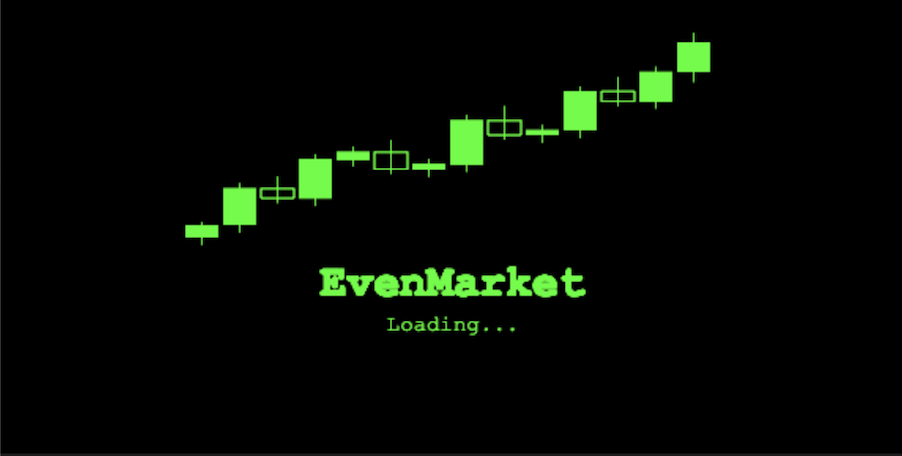
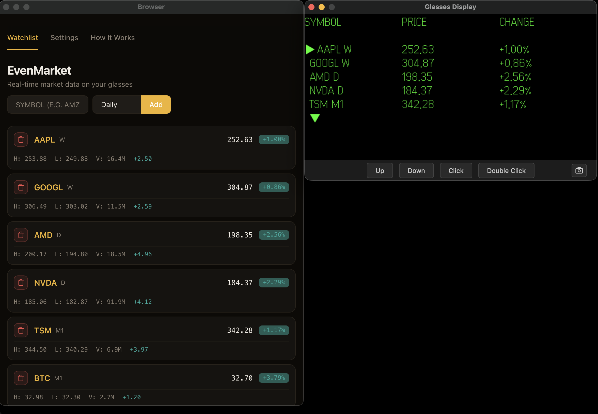
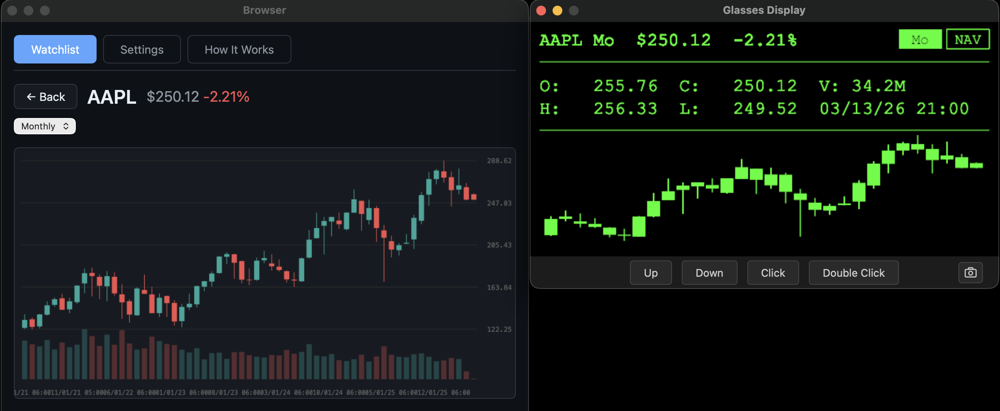
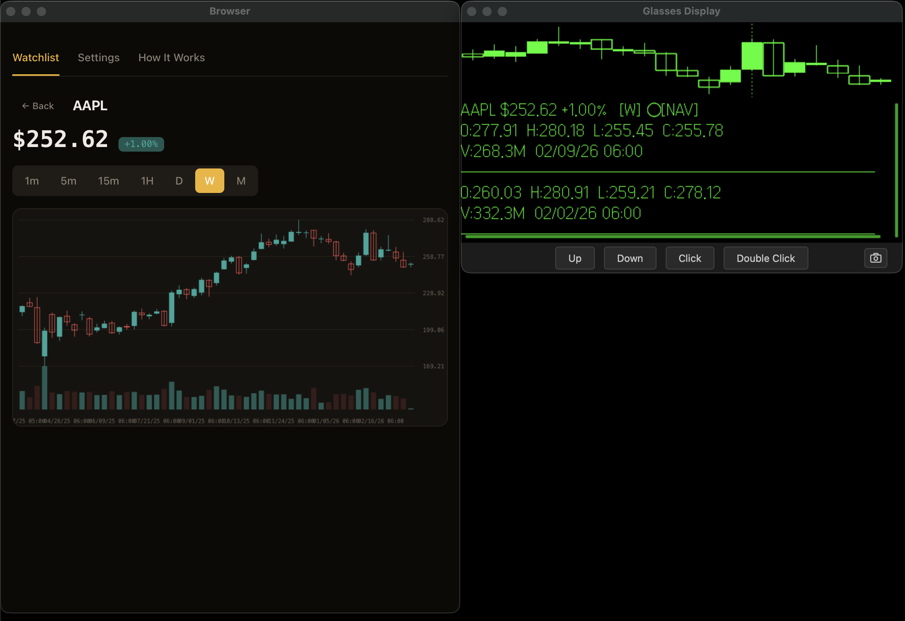
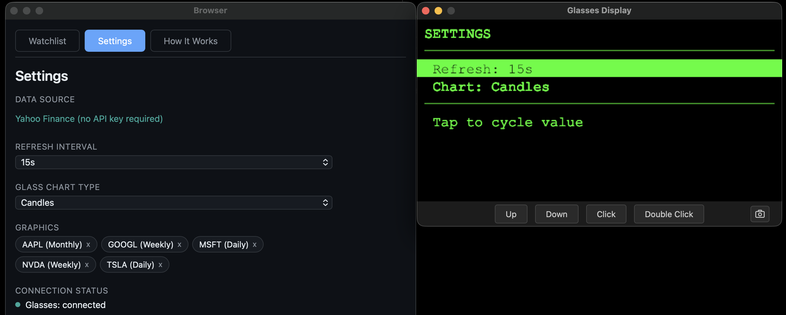

# EvenMarket

Real-time market watchlist, interactive candlestick charts, and candle-by-candle navigation for **Even Realities G2** smart glasses — powered by Yahoo Finance.



---

## Features

- **Multi-asset watchlist** — Stocks (AAPL, TSLA), Forex (EURUSD, GBPJPY), Commodities (XAUUSD, OIL) all in one list
- **Graphics model** — Each watchlist entry is a *graphic*: a symbol + timeframe pair. Track AAPL on Daily and 1-minute simultaneously
- **Interactive candle navigation** — Scroll candle-by-candle on glasses with flashing highlight, OHLCV + datetime updates per candle
- **Per-graphic timeframe cycling** — Tap to cycle through M1 / M5 / M15 / H1 / D / W / Mo without leaving the detail screen
- **Dual rendering** — Synchronized glasses display (576x288 monochrome canvas pushed via Even Hub SDK) and full-color web dashboard
- **Sparkline & candlestick charts** — Choose between area sparkline or mini candle charts on glasses
- **No API key required** — Uses Yahoo Finance with a built-in Vite proxy for CORS-free development
- **Auto-refresh** — Configurable polling interval (5s–60s)
- **Background persistence** — Audio context + Web Locks keep the app alive when backgrounded

---

## Screenshots

| Watchlist | Stock Detail |
|-----------|-------------|
|  |  |

| Candle Navigation | Settings |
|-------------------|----------|
|  |  |

### Demo

https://github.com/fabioglimb/even-market/raw/main/media/demo.mp4

---

## Glasses Navigation

```
WATCHLIST
  Scroll up/down    Navigate between graphics
  Tap               Open selected graphic detail
  Tap [Settings]    Open settings screen
  Double-tap        (no action on watchlist)

STOCK DETAIL
  Scroll up/down    Move between [TF] and [NAV] action buttons
  Tap [TF]          Enter timeframe navigation mode
  Tap [NAV]         Enter candle navigation mode
  Double-tap        Back to watchlist

TIMEFRAME NAVIGATION
  The [TF] button blinks to show the mode is active.
  Scroll up/down    Cycle through M1 / M5 / M15 / H1 / D / W / Mo
  Tap               Confirm selection and exit TF nav
  Double-tap        Exit TF nav

CANDLE NAVIGATION
  The [NAV] button blinks to show the mode is active.
  Scroll up/down    Move candle-by-candle (viewport pans automatically)
  Tap               Exit candle nav (back to button mode)
  Double-tap        Exit candle nav

  The highlighted candle flashes (500ms solid / dotted cycle).
  OHLCV and datetime update in real-time as you scroll.

SETTINGS
  Scroll up/down    Move between Refresh Interval and Chart Type
  Tap               Cycle the selected setting value
  Double-tap        Back to watchlist
```

---

## Supported Assets

| Type | Examples | Yahoo Format (auto-mapped) |
|------|----------|---------------------------|
| Stocks | AAPL, TSLA, MSFT, NVDA | Direct ticker |
| Forex | EURUSD, GBPUSD, USDJPY | Appends `=X` |
| Gold | XAUUSD | Maps to `GC=F` |
| Silver | XAGUSD | Maps to `SI=F` |
| Oil | OIL, WTIUSD | Maps to `CL=F` |
| Brent | BRENT | Maps to `BZ=F` |
| Natural Gas | NATGAS | Maps to `NG=F` |
| Crypto | BTC-USD, ETH-USD | Direct ticker |
| ETFs | SPY, QQQ, IWM | Direct ticker |

Just type the symbol naturally — the app handles Yahoo Finance ticker conversion automatically.

---

## Quick Start

### Prerequisites

- Node.js 18+
- npm

### Development

```bash
cd apps/even-market
npm install
npm run dev
```

Open `http://localhost:5173` in your browser. The web dashboard is fully functional without glasses connected.

### Keyboard Shortcuts (Web Testing)

| Key | Action |
|-----|--------|
| `Arrow Up / Down` | Navigate / scroll |
| `Enter` | Select / confirm |
| `Escape / Backspace` | Go back |
| `c` | Toggle candle navigation |
| `r` | Cycle timeframe resolution |

### Build & Package

```bash
npm run build          # TypeScript check + Vite production build
npm run pack           # Build + package as .ehpk for Even Hub
npm run pack:check     # Validate package without building
```

### Deploy to Glasses

```bash
npm run qr             # Generate QR code for sideloading
```

Scan the QR code with the Even Realities companion app to install on your G2 glasses.

---

## Architecture

```
src/
  state/
    types.ts          GraphicEntry, AppState, Settings
    actions.ts        Action union type (20 actions)
    reducer.ts        Pure state transitions, candle nav logic
    selectors.ts      Display data formatting for glasses
    store.ts          Minimal Redux-like store with subscriptions
  data/
    yahoo-finance.ts  Quote + candle fetching, symbol auto-mapping
    poller.ts         Periodic quote refresh, candle caching
  glass/
    bootstrap.ts      Orchestrator: store, poller, SDK bridge, flash timer
    canvas-renderer.ts  576x288 canvas rendering, action buttons
    chart-renderer.ts   Sparkline + mini candles with highlight/flash
    bridge.ts         Even Hub SDK wrapper
    composer.ts       Page layout composition for SDK
    layout.ts         Display dimensions and chart area constants
    png-utils.ts      Canvas to PNG byte array conversion
  web/
    main.ts           Web UI router
    screens/
      watchlist.ts    Table with symbol + timeframe + add form
      chart.ts        Full interactive chart with hover crosshair
      settings.ts     Configuration panel
    styles.css        Dark theme styling
  input/
    keyboard.ts       Keyboard bindings for web testing
    action-map.ts     Even Hub gesture to action mapping
    gestures.ts       Tap/scroll debouncing
  utils/
    format.ts         Price, percent, volume, candle time formatting
    keep-alive.ts     Background persistence (audio + web locks)
  main.ts             Entry point: boots glasses + web + keyboard
```

### State Flow

```
User gesture (glasses scroll/tap)
  -> action-map.ts (debounce + map to Action)
  -> store.dispatch(action)
  -> reducer.ts (pure state transition)
  -> subscribers notified
    -> selectors.ts (format DisplayData)
    -> canvas-renderer.ts (draw to canvas)
    -> bridge.ts (push PNG to glasses)
    -> web UI (update HTML)
  -> bootstrap.ts side effects (fetch candles, persist settings, manage flash timer)
```

---

## Configuration

### Default Watchlist

The app ships with 5 default graphics:

| Symbol | Timeframe |
|--------|-----------|
| AAPL | Daily |
| GOOGL | Daily |
| MSFT | Daily |
| NVDA | Daily |
| TSLA | Daily |

Add more via the web dashboard or glasses settings screen.

### Settings

| Setting | Options | Default |
|---------|---------|---------|
| Refresh Interval | 5s, 10s, 15s, 30s, 60s | 15s |
| Glass Chart Type | Sparkline, Candles | Sparkline |

Settings persist to localStorage and auto-migrate from older formats.

---

## Technical Details

- **Display**: 576 x 288 pixels, monochrome (grayscale maps to green on G2 lenses)
- **Font**: 22px Courier New, 28px line height
- **Chart area**: 540 x 130 pixels, up to 30 candles visible with automatic viewport panning
- **Candle flash**: 500ms interval alternating solid white / dashed outline
- **Cache**: 60-second candle cache keyed by `symbol:resolution`
- **Gesture debouncing**: 220ms tap cooldown, 56ms scroll debounce, 110ms post-tap scroll suppression

---

## Roadmap

- **Price alerts** — Set a price threshold on any graphic (e.g. AAPL > $260). Glasses notification triggers when the condition is met during polling. Simple alert model in state with configurable direction (above/below) and one-shot or repeating modes.

- **Change coloring on glasses** — Use brightness to encode direction: brighter rows for positive change, dimmer for negative. Gives instant visual feedback on the watchlist without reading numbers.

- **Watchlist scrolling** — Visible window that scrolls with the highlight when graphics exceed the ~6 rows that fit on the 288px display. Scroll indicator on the right edge showing position in the list.

- **Portfolio tracking** — Attach quantity and average price to each graphic. Show per-position P&L on the detail screen and total portfolio value as a summary line at the top of the watchlist.

- **Market status indicator** — Display open / closed / pre-market / after-hours state using the `marketState` field from Yahoo Finance. Dim the price row or show a badge when the market is closed so you know if data is stale.

---

## License

MIT
